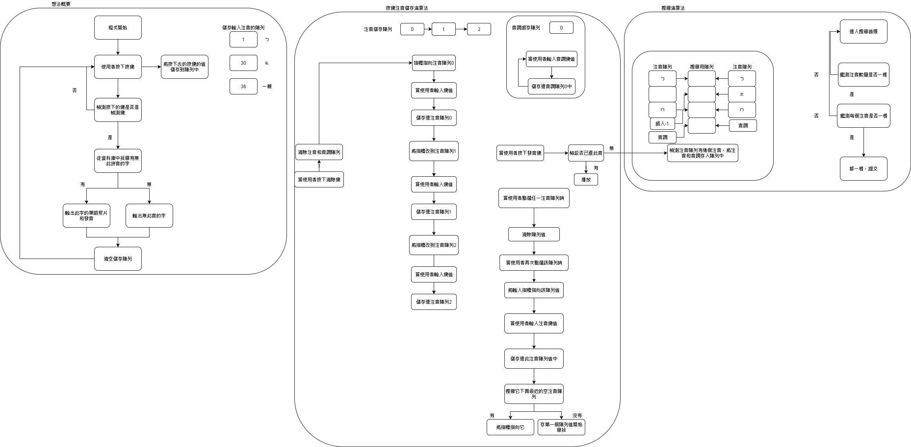
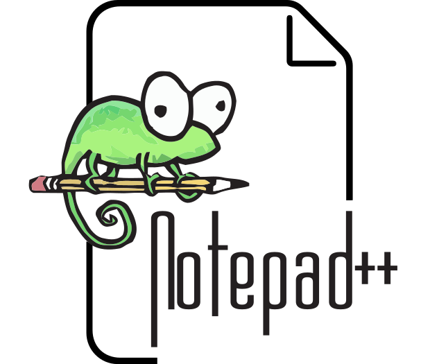

<h1 style="text-align:center">貓拼音 (一款適合幼兒使用的注音學習android app)</h1>

<h5 style="text-align:right">作者:HiCat</h5>

---

## 目錄:

1. ### [製作原因](#1)

2. ### [程式流程規劃](#2)

3. ### [各版本介紹](#3)

4. ### [音檔下載方式](#4)

5. ### [後期發展規劃](#5)

6. ### [感謝](#6)

---

<h2 id="1">製作原因:</h2>

### 我會製作此android程式是因為我發現我們小時候學習注音及詞的發音時，常常需要花費很長的時間來學習。我就想到可不可以設計一個軟體，它可以隨便排列注音，並發音和提供發此音的字。

### 在想完初步的規畫後，我開始想要在哪個平台上開發。最初是設想在電腦平台(Windows或Linux)上開發，但我想到手機在近幾年的發展，小孩們不一定會用電腦，但一定會用手機，並且手機的互動性和易用性比電腦好，所以最終我決定先在android平台上開發此程式(電腦版會視情況再開發)。

---

<h2 id="2">程式流程規劃:</h2>

### 再規劃好初始設計和製作平台後，我開始畫流程圖，以下是貓拼音的流程圖。(此流程圖為預先規劃的流程，後續製作將不一定朝此方向設計，但相差不多。)

### 當程式開始，程式會先載入注音和例子的音檔，再來程式會監測使用者按下的按鍵。如果是注音鍵或音調鍵，就將按鍵的鍵值存入儲存陣列中。如果按下的是檢測鍵，程式就會進入按鍵注音儲存演算法(後面會詳細介紹)並用搜尋演算法(後面會介紹)從資料庫中尋找有無此發音，有就發出此音，沒有就發出錯誤的音效。如果按下的是清除鍵，就將儲存陣列中的鍵值清空。

### 再來講按鍵注音儲存演算法。當使用者按下搜尋鍵後，程式會進入按鍵注音儲存演算法，演算法會先將音調存入音調儲存陣列，再來檢測鍵值儲存陣列裡是否為空值。如果有鍵值就存入注音儲存陣列。如果是空值並且後面都沒有鍵值時，就將注音儲存陣列存入-1。如果是中間的陣列是空值(並且後面陣列有鍵值)時，就將後面的鍵值往前存入注音儲存陣列，並在後面存入-1。做完後進入搜尋演算法。

### 最後講搜尋演算法。希望使用陣列儲存可發音的注音，並用二分搜尋找，如果找到就回傳發音音檔和照片的儲存位置，沒有就回傳-1。

### 注音將會用以下方式替換成數值存入鍵值存入儲存陣列中:

| 注音| 鍵值|
| --- | --- |
|  ㄅ |  1  |
|  ㄆ |  2  |
|  ㄇ |  3  |
|  ㄈ |  4  |
|  ㄉ |  5  |
|  ㄊ |  6  |
|  ㄋ |  7  |
|  ㄌ |  8  |
|  ㄍ |  9  |
|  ㄎ |  10 |
|  ㄏ |  11 |
|  ㄐ |  12 |
|  ㄑ |  13 |
|  ㄒ |  14 |
|  ㄓ |  15 |
|  ㄔ |  16 |
|  ㄕ |  17 |
|  ㄖ |  18 |
|  ㄗ |  19 |
|  ㄘ |  20 |
|  ㄙ |  21 |
|  一 |  22 |
|  ㄨ |  23 |
|  ㄩ |  24 |
|  ㄚ |  25 |
|  ㄛ |  26 |
|  ㄜ |  27 |
|  ㄝ |  28 |
|  ㄞ |  29 |
|  ㄟ |  30 |
|  ㄠ |  31 |
|  ㄡ |  32 |
|  ㄢ |  33 |
|  ㄣ |  34 |
|  ㄤ |  35 |
|  ㄥ |  36 |
|  ㄦ |  37 |

---

<h2 id="3">各版本介紹:</h2>

### Beta 1.0 :

#### 更新內容: 此版本是第一個發布的測試版本，初步功能已製作完畢，已加入ㄅ開頭字的音和例子。

#### 紀錄: 在程式內，重要的函式、函數和代碼均有進行注釋，後續完整性80-90%時，會製作更完整的MarkDown文檔來介紹程式的運作流程，在log資料夾也有製作時的紀錄文檔，可以在此看到製作時發生的問題和製作進度報告。

---

<h2 id="4">音檔下載方式:</h2>

### 注音和例詞的音檔是運用Translate Shell這個開源工具在Google Translate上下載的，可以在log資料夾的translate資料夾看到Shell代碼和下載的音檔。

### 在下在音檔時也遇到不少的問題:

1. ### Translate Shell不能在windows作業系統的cmd上執行。

### 解決方式: 使用MSYS2來執行Translate Shell。

2. ### 遇到Google Translate的下載限制，每半小時只能下載30個音檔。

### 解決方式: 當下載後發現檔案大小錯誤時，等待半小時，再下載一次，直到檔案大小正常。

3. ### 遇到當此注音排列無發音時，程式還是會下再一個空檔案的問題。

### 解決方式: 使用Shell的cmp查看音檔是否與空音檔長的一樣，是就刪除。

4. ### android不能使用.ts檔來存音檔，需要使用.ogg檔才能正常執行。

### 解決方式: 使用Shell+ffmpeg來將.ts檔轉成.ogg檔。

---

<h2 id="5">後期發展規劃:</h2>

### 後期規劃將加入以下更新項目:

- [ ] ### 加入注音遊戲(遊戲玩法:將出現一個字，會缺少一個音，玩家將要從掉落的注音中找尋缺少的注音。)

- [ ] ### 注音查詢成就(查詢過的字將可在成就櫃找到它的例詞和圖。)

---

<h2 id="6">感謝:</h2>

* ## [Translate Shell](https://www.soimort.org/translate-shell/)

* ## [MSYS2](https://www.msys2.org/)

* ## [Google Translate](https://translate.google.com/)

* ## [Irasutoya](https://www.irasutoya.com/)

* ## [Android Studio](https://developer.android.com/studio/)

* ## [Notepad++](http://notepad-plus-plus.org/)

* ## [Markdown](https://daringfireball.net/projects/markdown/)

* ## [MarkText](https://marktext.app/)

### 在此感謝幫助過我的人和開源項目，沒有你們，貓拼音就無法發展到現在。

---

##### 貓拼音的作者為HiCat，以GPL-3.0協議開源，使用的素材均為開放式素材，如有侵犯權益，請立即告訴我，我將立刻更換。

###### 2021/9/20 Made by:Hi Cat